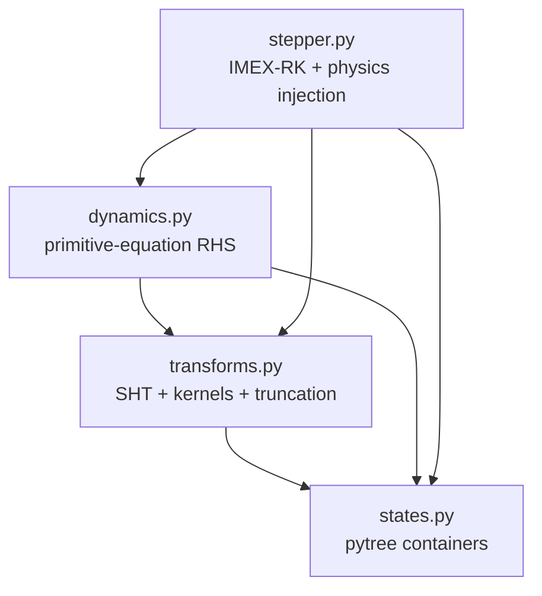
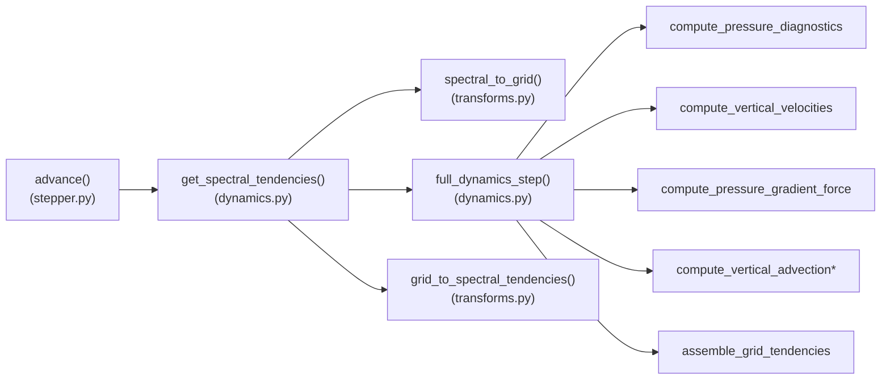

# Developer's Guide — `gfs_dynamical_core.jax`

This guide is about the **code itself**: how the package is laid out, how the
modules depend on each other, what one time step looks like as a call graph,
which invariants you must not break, and how to extend or test the core. It is the
complement to [`manual.pdf`](manual.pdf) (the *user* manual), which covers the
numerics, the physics, and how to *use* the differentiable model. Read the manual
for "what it computes and why"; read this for "how the code is organised and how
to change it safely".

> **Audience:** someone about to modify the core, add a physics package, wrap it
> for a new driver, or debug it — not just run it.

---

## 1. Repository map

```
gfs_dynamical_core/
├── gfs_dynamical_core/            # the installed package
│   ├── __init__.py                # exports the Fortran-backed climt component
│   ├── component.py               # GFSDynamicalCore  (Fortran core, climt wrapper)
│   ├── component_jax.py           # GFSDynamicsJAX    (JAX core, climt wrapper)
│   ├── _gfs_dynamics.pyx / .c / .so   # Cython bridge to the Fortran dynamics
│   ├── _lib/                      # vendored OpenBLAS / FFTW / SHTNS for the Fortran core
│   ├── numpy_backend/             # a pure-numpy port (offline/browser use)
│   └── jax/                       # >>> THE DIFFERENTIABLE CORE (this guide) <<<
│       ├── __init__.py            # enables float64
│       ├── states.py              # state containers (pytrees)
│       ├── transforms.py          # spherical-harmonic transforms
│       ├── dynamics.py            # primitive-equation right-hand side
│       └── stepper.py             # IMEX-RK time integration + physics injection
├── tests/                         # test_jax_*.py validate the JAX core vs Fortran
├── examples/
│   └── stochastic_sppt/           # a downstream consumer: trainable SPPT (see §10)
├── docs/
│   └── gfs_jax_manual/            # the user manual, this guide, and examples
└── setup.py / pyproject.toml / Makefile   # packaging & the Cython/Fortran build
```

There are **three implementations of the same dynamics** in the repo, and it helps
to know which is which:

| backend | where | role |
|---------|-------|------|
| **Fortran** | `_gfs_dynamics.*`, `component.py`, `_lib/` | the operational-lineage reference; the JAX port is validated against it |
| **JAX** | `gfs_dynamical_core/jax/` | the differentiable core this guide documents |
| **numpy** | `numpy_backend/` | a dependency-light port (e.g. browser/Pyodide) |

The JAX core is a faithful re-derivation of the Fortran numerics; when a JAX result
disagrees with Fortran, the Fortran is the reference (the JAX bugs found during the
port — reality symmetry, scrambled tendencies — were all "JAX diverged from
Fortran" discoveries).

---

## 2. The JAX package: module dependency graph

Four modules, a strict layering (arrows = "imports from"):



`states.py` has no internal dependencies (pure data). `stepper.py` is the top of
the stack and the public entry point. There are **no circular imports**; a couple
of functions do *local* imports (`from .transforms import s2_forward` inside
`compute_dry_mass_fixer` / `_physics_tendencies_to_spectral`) to keep the module
load order clean — keep it that way.

---

## 3. The state model: pytrees, traced vs static leaves

Every state and config is a `@flax.struct.dataclass` — i.e. a **JAX pytree**. This
is the single most important structural decision in the core, because it is what
makes `jit`/`grad`/`vmap` see *through* the containers to the arrays inside.

Two kinds of field:

- **Array leaves** (default): traced by JAX. Differentiable, batched by `vmap`,
  baked/traced by `jit`. Example: every field of `SpectralState`; `radius` in
  `TransformConfig`; the semi-implicit matrices in `StepperConfig`.
- **Static aux** (`struct.field(pytree_node=False)`): *not* traced; part of the
  pytree's structure/hash, so changing it triggers a recompile. Used for values
  that must be Python-level constants at trace time:

```python
# transforms.py
class TransformConfig:
    L: int        = struct.field(pytree_node=False)   # shapes depend on it -> static
    sampling: str = struct.field(pytree_node=False, default="gl")
    ntrunc: int   = struct.field(pytree_node=False, default=None)
    radius: float = 6371000.0                          # ordinary leaf (traced)

# stepper.py
class StepperConfig:
    explicit: bool = struct.field(pytree_node=False, default=False)  # branch at trace time
    ...
```

**Why it matters for you:** if you add a field whose *value drives control flow or
array shapes* (a level count, a mode flag), make it `pytree_node=False`. If it is a
numeric quantity you might want to differentiate or vary continuously (a physical
constant, a matrix), leave it a normal leaf. Getting this wrong yields either a
tracer-in-`if` error (a traced value used in Python control flow) or silent
recompilation on every call.

**Why vorticity/divergence, not `u`/`v`?** The prognostic momentum variables are
$\zeta,D$ because the linear (gravity-wave, diffusion) operators are *diagonal* in
that basis in spectral space. `u,v` exist only transiently in grid space.

The container inventory (`states.py`): `SpectralState`, `GridState`,
`GridGradients` (horizontal derivatives produced by the transform),
`SpectralTendencies`; plus `PhysicsTendencies` (in `stepper.py`) for the
physics-injection interface.

---

## 4. Anatomy of one time step

The public call is `advance(state, ...)` (or `advance_with_tendencies(...)`).
Internally, each of the three IMEX-RK stages evaluates the nonlinear right-hand
side by the same pipeline. The call graph of **one RHS evaluation**:



In words, one stage:

1. `advance` computes the **linear** gravity-wave tendencies analytically
   (`compute_linear_tendencies`, an inner closure) and calls
   `get_spectral_tendencies` for the **full** tendency.
2. `get_spectral_tendencies` does the spectral→grid→(nonlinear RHS)→spectral round
   trip.
3. `advance` subtracts linear from full to get the **nonlinear** part, forms the
   explicit predictor, and calls `solve_implicit` (the pre-inverted `d_hyb_m`
   matrices) for divergence/temperature/`lnps`. Vorticity and tracers are advanced
   explicitly.
4. After three stages: implicit hyper-diffusion/Rayleigh damping (a division by a
   `denom` factor), then the optional post-RK dry-mass fixer.

The `explicit=True` path (a static branch) skips the semi-implicit machinery
entirely and does a plain explicit RK3 — useful for testing but time-step-limited.

**Where to read what:** the *linear operator algebra* (`amhyb`, `bmhyb`,
`tor_hyb`, `svhyb`, `d_hyb_m`) is set up in `init_semi_implicit_matrices` and
applied in `compute_linear_tendencies` / `solve_implicit`. The *nonlinear physics*
of the primitive equations lives entirely in `dynamics.py`.

---

## 5. Invariants you must not break

These are enforced at specific points and the model is unstable or wrong without
them. If you touch the transform or tendency code, preserve them.

1. **Reality symmetry + triangular truncation after *every* forward transform.**
   `enforce_triangular_truncation(flm, L, T)` must run on the output of every
   `s2_forward`-producing path (`grid_to_spectral`, `grid_to_spectral_tendencies`,
   `_physics_tendencies_to_spectral`, the dry-mass fixer, the SPPT pattern step).
   It zeroes `l>T` / `|m|>T` **and** rebuilds negative-`m` modes from positive-`m`
   ones. Skipping the reality rebuild lets an imaginary-valued grid field grow as
   an undamped instability and blow up around day 7–8 (this was a real bug). See
   the manual §5 for the physics.
2. **Bottom-to-top vertical indexing** (`k=0` = surface) everywhere in the JAX
   core. `init_semi_implicit_matrices` flips to/from the Fortran top-to-bottom
   convention *internally*; do not leak that flip out.
3. **Float64.** Set `JAX_ENABLE_X64=True` (and pin CPU on Apple Silicon) before
   importing `jax`. `jax/__init__.py` also asserts it.
4. **Kernel prebuild before tracing.** `prebuild_kernels(L, sampling)` must run
   eagerly before any `jit`-compiled step — kernel construction is data-dependent
   and not traceable. Under `jit` the kernels are read from a module cache and
   baked in as constants.
5. **Dry-mass fixer runs *after* the full RK scheme**, never inside a stage —
   doing so inside a stage replaces the physical `lnps` tendency with ~0 and
   corrupts the implicit gravity-wave solve (comment in `advance`).

---

## 6. The tracing contract: writing `jit`/`grad`/`vmap`-safe code

The core is "pure `jnp`" by design. To keep it that way when you edit it:

- **No data-dependent Python control flow on traced values.** `if x > 0:` where
  `x` is a traced array fails under `jit`. Use `jnp.where`, `jax.lax.cond`,
  `jax.lax.scan`. The existing code uses `jnp.where` heavily for exactly this
  (e.g. the guards against `0**k` at the model top in
  `compute_pressure_diagnostics`).
- **Branch on *static* fields only.** `if stepper_config.explicit:` is fine
  because `explicit` is `pytree_node=False` (resolved at trace time). This is the
  idiom for compile-time configuration.
- **`static_argnums` for shape/length-determining args.** Loop lengths and
  booleans passed positionally must be static, e.g.
  `jax.jit(run, static_argnums=(2,))` where arg 2 is `n_steps`. `flax` structs
  with `pytree_node=False` aux (like `ModelBundle`) can be passed as ordinary
  traced args — their static fields ride along as pytree metadata, so one compiled
  graph is reused across steps.
- **Prefer `lax.scan` over Python loops** for time stepping (a Python loop unrolls
  the graph). For long/deep rollouts wrap the scan body in `jax.checkpoint` to
  bound reverse-mode memory.
- **Two known warts to be aware of** (not blockers, but don't imitate):
  - `stepper.py` has a module global `jax_debug_step` incremented inside
    `advance` — a side effect that survives `jit` tracing only as a
    trace-time counter; it is harmless but not functionally pure.
  - `dump_jax_intermediate` guards `isinstance(x, jax.core.Tracer)` and no-ops
    under `jit`; it is a debug hook writing Fortran-layout binaries for
    bit-comparison, not part of the model.

---

## 7. Extension points

The core is designed to be extended at three seams.

**a. Add a physics package.** Return a `PhysicsTendencies` (grid space, SI units,
bottom-to-top) and pass it as `phys_tends` to `advance_with_tendencies`. This is
exactly what `held_suarez.py` does; a machine-learned parametrization returns the
same container. The core transforms it to spectral internally.

**b. Inject directly in spectral space.** Pass a `SpectralTendencies` as
`spec_tends`; it is added to the state *without* a grid→spectral transform. This is
the **SPPT / SKEB injection point** — SPPT multiplies grid tendencies (path a),
SKEB adds to `d_vorticity_d_t` (path b). Both `phys_tends` and `spec_tends` may be
given, or either may be `None` (both `None` ⇒ dynamics-only, identical to
`advance`).

```python
advance_with_tendencies(spec_state, phys_tends, phis_grads, dyn_config,
                        trans_config, stepper_config, latitudes,
                        gauss_weights=None, pdryini=None, spec_tends=None)
```

**c. Add a prognostic tracer.** `tracers` is a leading-axis stack
`(n_tracers, n_lev, L, 2L-1)`; the vertical advection uses the positive-definite
Thuburn limiter. Extend the stack and the tracer path follows automatically. *Note
the forward-mode `0/0` pitfall in the limiter when a tracer is identically zero
(manual §14) — seed a tiny positive field if you will differentiate through it.*

**d. Swap the transform library.** If you replace `s2fft` with a non-JAX SHT
(e.g. SHTNS for speed), wrap it with `jax.custom_vjp` (supply the adjoint, which
for an SHT is just the transpose transform) or `jax.pure_callback` (black box) so
the surrounding model stays differentiable. This is the documented differentiability
strategy.

**e. New resolution.** Add an entry to the `RESOLUTIONS` table (in the model
builder / `examples/.../config.py`): `(L, ntrunc, dt)`. Everything else is derived.

---

## 8. The climt/sympl integration layer

The pure-JAX core is *driver-agnostic*. To run it inside the
[climt](https://climt.readthedocs.io)/sympl framework (unit-aware state
dictionaries, component composition), `component_jax.py` wraps it:

- `GFSDynamicsJAX(TendencyStepper)` exposes `input_properties` (the CF-named,
  unit-and-dimension-tagged fields it consumes) and an `array_call(state,
  timestep, ...)` that unpacks the sympl state into arrays, builds a
  `SpectralState`, calls the JAX `advance`, and repacks.
- It composes with other climt `TendencyComponent`s (physics) via
  `ImplicitTendencyComponentComposite`, merging their `input_properties` /
  `tendency_properties`.

If you are building a *research* pipeline (like `examples/stochastic_sppt`), you
usually bypass this layer and call the JAX core directly — the climt wrapper exists
for interoperability with the broader climt ecosystem and for parity testing
against the Fortran `GFSDynamicalCore`.

---

## 9. Testing

Tests for the JAX core live in top-level `tests/` and are runnable with the
project's `climt` conda env:

| test file | covers |
|-----------|--------|
| `test_jax_states.py` | pytree round-trips, shapes |
| `test_jax_transforms.py` | forward/inverse SHT accuracy, spin transforms, truncation & reality |
| `test_jax_dynamics.py` | each RHS term vs the Fortran/analytic reference |
| `test_jax_stepper.py` | one-step and multi-step integration, semi-implicit vs explicit |
| `test_jax_component*.py` | the climt wrapper and its component-API parity |

The validation philosophy is **compare in grid space against the Fortran
reference** (spectral coefficients differ by library-specific scale/phase
conventions, so grid-space comparison is the ground truth). A test that passes
against a *mis-constructed* scenario proves nothing — construct the reference
carefully.

Run them (absolute env paths avoid `conda activate` per call):

```bash
/path/to/envs/climt/bin/pytest tests/test_jax_transforms.py -q
# the SPPT example has its own suite:
/path/to/envs/climt/bin/pytest examples/stochastic_sppt/tests -q
```

---

## 10. A downstream consumer as a blueprint: `examples/stochastic_sppt`

The trainable-SPPT example is the reference for *how to build a research pipeline
on the core*, and its layout is worth copying:

```
examples/stochastic_sppt/
├── config.py          # resolutions + experiment/train dataclasses
├── model.py           # build_model(): wire the core into a ModelBundle (climt for constants)
├── held_suarez.py     # the deterministic physics package (PhysicsTendencies)
├── sppt.py            # the stochastic scheme (spectral AR(1) pattern + injection)
├── rollout.py         # checkpointed, vmap-able ensemble integration
├── metrics.py         # scoring / diagnostics (pure jnp)
├── train.py           # jit(value_and_grad) optimisation loop
├── tests/             # one test module per source module
├── figures/           # reproducible figure pipeline (its own artifacts/)
├── README.md          # landing page
├── tutorial.pdf/.tex  # the pedagogical write-up
└── EXPERIMENT_LOG.md  # append-only design/decision log
```

Structural lessons it encodes:
- **`ModelBundle` as one pytree** carrying every config + operator, with `dt`/
  `n_lev` as static aux — so a jitted step reuses one compiled graph.
- **Separate the differentiable compute from plotting** (`figures/plot.py` is pure
  numpy) — figures re-render instantly without re-running the model.
- **The pattern generator (`sppt.py`) is written so SKEB reuses it verbatim**;
  only the injection point changes (grid `phys_tends` → spectral `spec_tends`).

The manual's own `docs/gfs_jax_manual/examples/_model.py` is a second, more
minimal blueprint of the same "assemble a model from the core" pattern.

---

## 11. Conventions & gotchas cheat-sheet

| # | thing | rule |
|---|-------|------|
| 1 | precision | float64 always; pin CPU on Apple Silicon before importing jax |
| 2 | vertical index | bottom-to-top, `k=0` = surface |
| 3 | grid dims (GL) | `n_lat = L`, `n_lon = 2L-1` |
| 4 | after forward SHT | always `enforce_triangular_truncation` (truncation **+** reality) |
| 5 | kernels | `prebuild_kernels` eagerly, before any `jit` |
| 6 | control flow | branch only on `pytree_node=False` fields / static args; else `jnp.where`/`lax.cond` |
| 7 | time loop | `lax.scan`, not Python loops; `jax.checkpoint` for long reverse-mode |
| 8 | prognostic momentum | vorticity/divergence, not `u`/`v` |
| 9 | physics | grid → `phys_tends`; spectral → `spec_tends`; both optional |
| 10 | dry-mass fixer | after the full RK scheme, never inside a stage |
| 11 | zero tracer + forward-mode | seed a tiny positive tracer to avoid the limiter's `0/0` |
| 12 | complex spectral state | differentiate real grid-space inputs, not raw coefficients |

---

## 12. Contributing workflow

1. Work in the `climt` conda env (it resolves climt, jax, s2fft, sympl,
   gfs_dynamical_core).
2. Keep new core code **pure `jnp`** and pytree-friendly (§3, §6); if you must
   call non-JAX code, isolate it behind `custom_vjp`/`pure_callback`.
3. Add/extend a `test_jax_*.py` that compares against the Fortran or an analytic
   reference **in grid space**.
4. Run the relevant JAX test module and (for downstream work) the example's suite.
5. For research pipelines, keep an append-only `EXPERIMENT_LOG.md` of design
   decisions and their rationale (see the SPPT example).

---

*See also:* [`manual.pdf`](manual.pdf) (numerics & differentiable-modelling usage),
[`README.md`](README.md) (index + runnable examples).
```
