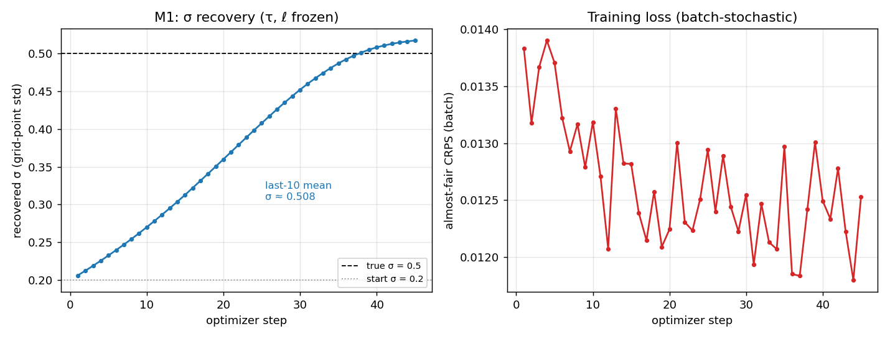

# Trainable, differentiable SPPT

A small, readable pipeline that builds a **stochastic** Held–Suarez atmospheric
model (SPPT — Stochastically Perturbed Parametrization Tendencies) and **learns
the parameters of its stochasticity by gradient descent through the model**.
Everything is pure `JAX` — `jit` / `grad` / `vmap`-able.

## 📖 Read this first

The full tutorial is **[`tutorial.pdf`](tutorial.pdf)** (source:
[`tutorial.tex`](tutorial.tex)). It is written to be read start-to-finish by a
student and is **self-contained** — it explains, from first principles:

- why a weather model needs randomness, and the SPPT scheme (Palmer et al. 2009);
- the spectral **AR(1) pattern generator** (full derivation of how σ, τ, ℓ set the
  variance and length scale);
- how the "truth" data is generated and stored, and **why one draw per case — and
  what multiple draws would buy you** (bias, cost, training-time impact);
- the **CRPS** scoring rule, the finite-ensemble bias, and the *fair* / *almost-fair*
  corrections;
- the calibration diagnostics — **spread–error ratio** and **rank histogram** — with
  derivations and an interpretation table;
- the learning problem in detail: **how you differentiate through randomness**
  (the reparameterization / pathwise gradient), **what the gradient is taken with
  respect to**, common random numbers, reverse-mode memory, and **why σ settles
  slightly above 0.5**;
- the train/validation protocol, the results (Milestone M1), how every figure was
  made, limitations, **exercises**, and further reading with references.

The companion **[`EXPERIMENT_LOG.md`](EXPERIMENT_LOG.md)** is the append-only record
of *why* each design choice was made (including the dead-ends).

## Quick start

Prerequisite: **float64 is mandatory** and on Apple Silicon the CPU backend must be
pinned (Metal can't do float64). Every entry point sets this automatically. Run
from the repository root so `examples.stochastic_sppt` is importable.

```bash
# build the identical-twin datasets once (cached under figures/_artifacts/)
python -m examples.stochastic_sppt.figures.run_sweep       --data-only
python -m examples.stochastic_sppt.figures.run_calibration --data-only

# run the M1 σ-recovery sweep (checkpoints every step; re-invoke until it prints
# DONE — it resumes from its checkpoint, so an interrupted run loses nothing)
python -m examples.stochastic_sppt.figures.run_sweep --target-steps 45 --budget-seconds 520

# calibration diagnostics at the recovered σ, then render all figures
python -m examples.stochastic_sppt.figures.run_calibration
python -m examples.stochastic_sppt.figures.plot           # pure numpy/matplotlib

# rebuild the tutorial PDF (needs a LaTeX toolchain)
latexmk -pdf tutorial.tex
```

The general-purpose entry points work directly too:

```bash
python -m examples.stochastic_sppt.generate_data --mode A --forecast T21 --out data/twin.pkl
python -m examples.stochastic_sppt.train --dataset data/twin.pkl --steps 45 --lr 0.03
```

## Result at a glance

σ is recovered from a deliberately-wrong 0.2 to ≈0.51 (crossing the true 0.5 near
step 38), and the recovered σ produces a calibrated ensemble on independent data.
See `tutorial.pdf` §9 for the figures and their interpretation.



## Repository tour

| file / dir | what it is |
|------------|------------|
| [`tutorial.tex`](tutorial.tex) / `tutorial.pdf` | **the full tutorial** |
| [`config.py`](config.py) | resolutions (T21…T127), experiment/train dataclasses |
| [`model.py`](model.py) | JAX Held–Suarez model on `gfs_dynamical_core.jax` |
| [`held_suarez.py`](held_suarez.py) | the Held–Suarez forcing (deterministic physics) |
| [`sppt.py`](sppt.py) | **the SPPT scheme**: params, AR(1) pattern, taper, application |
| [`rollout.py`](rollout.py) | checkpointed, `vmap`-able ensemble rollout |
| [`metrics.py`](metrics.py) | almost-fair CRPS + calibration diagnostics |
| [`diagnostics.py`](diagnostics.py) | extract verification fields from a spectral state |
| [`generate_data.py`](generate_data.py) | build Mode-A / Mode-B truth datasets |
| [`train.py`](train.py) | the afCRPS training loop (jit, vmap over cases) |
| [`figures/`](figures/) | reproducible figure pipeline (`run_sweep`, `run_calibration`, `plot`) |
| [`tests/`](tests/) | unit tests for every module |
